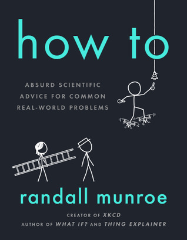

= yaml =
title: 'How To: Absurd Scientific Advice for Common Real-World Problems'
subtitle: 'Absurd but easily modelled'
= yaml =

* Author: Randall Munroe
* Published: September 2019
* Read: December 2019

## Description
Few among those who dabble in techy/sciency fields have not stumbled across the
webcomic [xkcd](https://www.xkcd.com/) written by ex-NASA employee
Randall Munroe. They appear everywhere, from university lecture slides
to weekly email updates from tech companies (partially due to the comics open
license). So it's no surprise that any books he releases are quite highly
anticipated and well-received.

In this book, he uses simple physics approximations to test bizarre ways of
doing (mostly) mundane tasks. Could you cross a river by boiling it with kettles? (Not likely.)
Are butterflies the future of high bandwith internet? (They would be good at it,
but still seems unlikely.) Could you use an escalator to charge you phone?
(Yes, along with a lot of other things.) And of course, the book is
 filled with witty diagrams of stick figures.

## The Good
The book was a fun read, witty, filled with comics and ample nerd references.
The math was light enough that I could follow along with only Physics 101 as
background without getting bogged down (but I probably couldn't explain much
of it to you now). 

My favourite chapters were How to Take a Selfie (probably the most practical
chapter in the book) and How to Play Football (most notably the analysis of the
calvary charge out of [Helm's Deep](https://www.youtube.com/watch?v=mE328QhF-VA)) 

## The Bad
Nothing comes to mind, so why look for them?

## Final Verdict
While I didn't learn much practical science that stuck with me, the book was a
great read for when you want to take a quick break and read something humorous and
_vaguely_ informative.

Another takeaway from the book is how very complicated physics situations
can be modelled quite simply by making basic assumptions and that these models
can be surprisingly accurate.

## Ratings <small>(out of 5)</small>
* Informational: ★★½
  * The book is not really meant to be informational, but I might have picked
    up a thing or two
* Enjoyable: ★★★★
  * Ridiculous physics situations explained along with 
    comics and nerd references
* Would Recommend: Yes

[xkcdComic]: https://media.xkcd.com/comics/bad_opinions.png