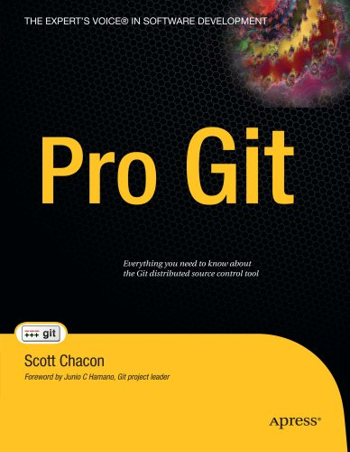
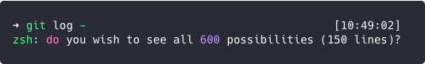

= yaml =
title: 'Pro Git'
subtitle: ''
= yaml =

* Author: Scott Chacon
* Published: August 2009
* Read: January 2020

## Description
A straight-forward guide to using `git` on the command line by git-evangelist [Scott Chacon](http://scottchacon.com/).
It starts by covering the basics like installation, making commits and branching. Later chapters
cover more arcane matters like how to set up your own git server, hooks and plumbing commands.
There was also a brief overview of different workflows.

Even though the book was over a decade old when I read it1 nearly everything was still
relevant and informative.

## The Good
The writing was clear and it did a good job of mentioning the most important of the 
command line switches (see image below) of Git's many options. The final chapter
which was on Git's internals, while not often applicable, was very interesting and
gave me an appreciation for how things work.

 
 

## The Bad
The writing style wasn't the most exciting, so the book wasn't exactly gripping.
There was a chapter on how to set up a Git server which is probably great if
you need to do that but wasn't exactly what I needed right now.

## Final Verdict
To just upgrade your knowledge of `git` commands I would recommend reading the chapters
_Git Basics_, _Git Branching_ and _Git Tools_. Read _Git Internals_ if you're curious and 
_Git on the Server_ if applicable.

## Ratings <small>(out of 5)</small>
* Informational: ★★★★
  * Git is probably the most used VCS out there so it's good to know how to work it
* Enjoyable: ★★
  * Readable, but not really enjoyable
* Would Recommend: Partially, see Final Verdict

<small>1. A new print edition came out in 2014, but they didn't have it at the library.
(Yes, I still favour printed books.) The book is open sourced and the online version is updated constantly.
I did skim through the new version and it looks mostly the same with some new appendices added.
</small>